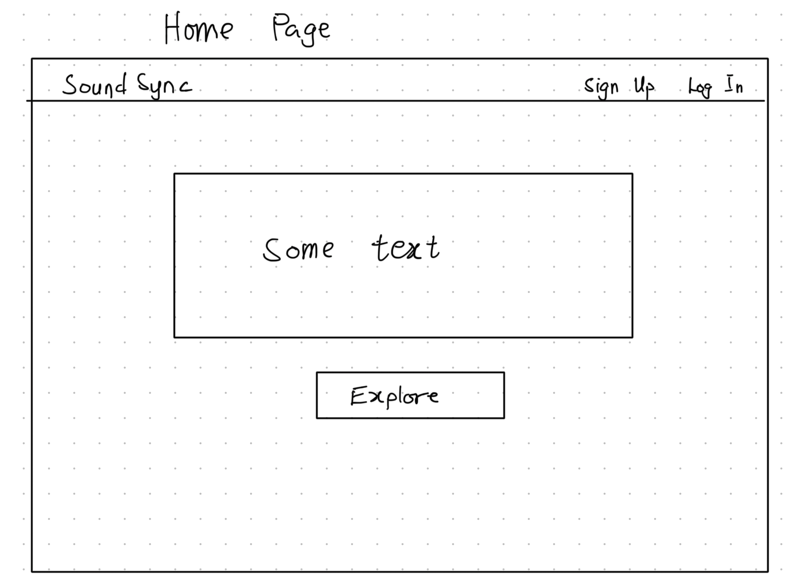
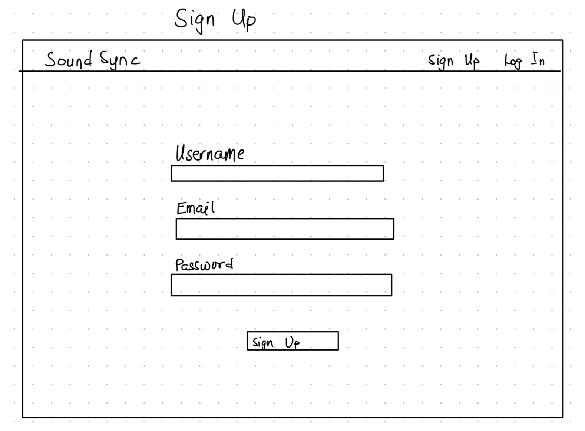
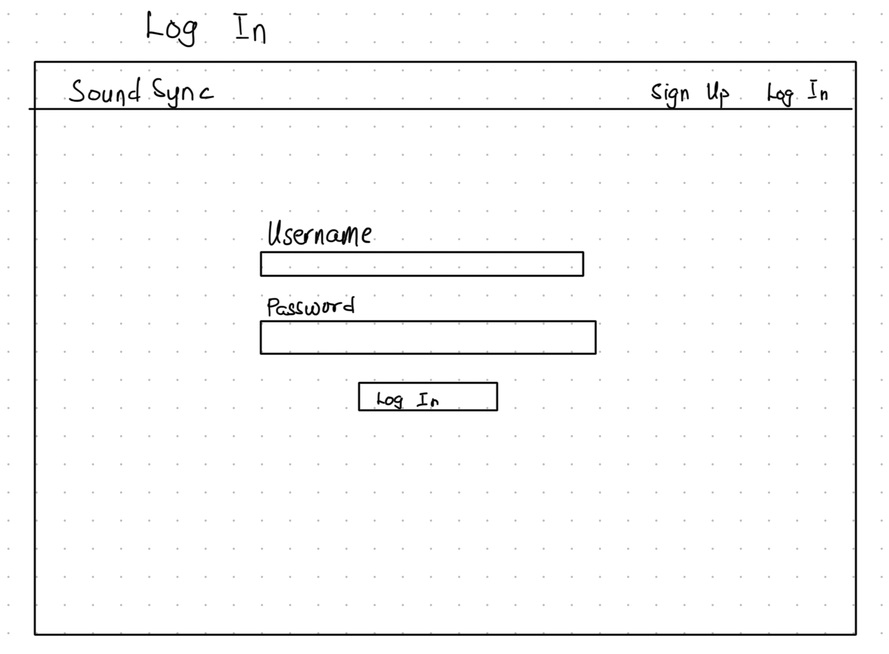
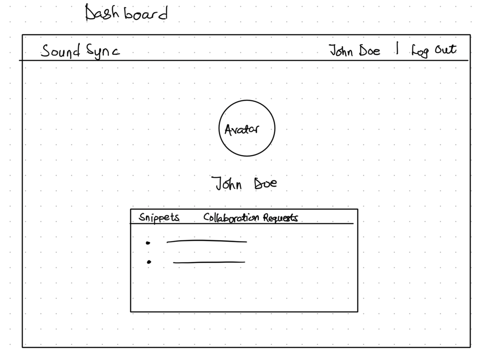
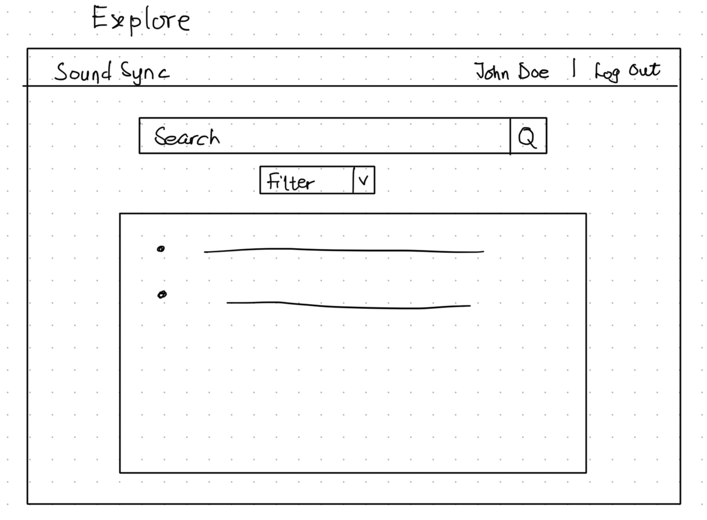

# SoundSync

## Overview

**SoundSync** is a web application designed to connect musicians and foster collaboration. It allows users to create profiles, upload short music snippets, and browse contributions from other artists. Each snippet is accompanied by genre tags and descriptions, making it easy for users to discover and connect with like-minded musicians. 

With features that enable users to leave feedback, initiate collaboration requests, and filter posts by genre or instrument type, SoundSync serves as a dynamic platform for both aspiring and experienced artists to showcase their work, receive constructive input, and explore creative partnerships within the music community.


## Data Model

In **SoundSync**, the application's data consists of four primary entities: **Users**, **Snippets**, **Comments** and **Collaborations**. Each entity plays a crucial role in the platform's functionality and user interaction.


### Data Entities and Relationships

1. **Users**: Represents the musicians using the platform. Each user has a unique profile containing personal information, instruments they play, and a collection of uploaded music snippets. Users can leave comments on snippets, initiate collaboration requests, and respond to requests from others.

2. **Snippets**: This entity contains the music snippets uploaded by users. Each snippet includes metadata such as the audio file URL, description, tags (for genre), and the user ID of the creator. Snippets serve as the primary content around which collaboration occurs.

3. **Comments**: Comments are tied to specific snippets and allow users to provide feedback. Each comment references the user who made it and contains the text of the comment along with a timestamp.

4. **Collaborations**: This entity tracks collaboration requests between users. Each collaboration request includes the requester and recipient user IDs, the snippet involved, and the status of the request (e.g., pending, accepted, declined). 

Example User Document
```json
{
  "_id": "60d21b4667d0d8992e610c85",
  "username": "musicmaestro",
  "email": "musicmaestro@example.com",
  "password": "$2b$10$yK0XchB3FQks7hG8xkm4Bu.b8ZQsqy1uFezM/4BSvqaEl3Um9i4ue", // a hashed password
  "instruments": ["Guitar", "Piano"],
  "genres": ["Rock", "Jazz"],
  "profilePicture": "https://example.com/profile/musicmaestro.jpg",
  "snippets": [
    "60d21b4667d0d8992e610c86", // reference to a Snippet
    "60d21b4667d0d8992e610c87"  // reference to another Snippet
  ],
  "createdAt": "2023-01-01T12:00:00Z",
  "updatedAt": "2023-01-01T12:00:00Z"
}
```

Example Snippet Document
```json
{
  "_id": "60d21b4667d0d8992e610c86",
  "user": "60d21b4667d0d8992e610c85", // reference to User
  "audioUrl": "https://example.com/audio/snippet1.mp3",
  "description": "My first rock composition",
  "tags": ["rock", "composition"],
  "genre": "Rock",
  "comments": [
    "60d21b4667d0d8992e610c88" // reference to a Comment
  ],
  "createdAt": "2023-01-02T15:00:00Z",
  "updatedAt": "2023-01-02T15:00:00Z"
}
```

Example Comment Document
```json
{
  "_id": "60d21b4667d0d8992e610c88",
  "user": "60d21b4667d0d8992e610c89", // reference to another User
  "snippet": "60d21b4667d0d8992e610c86", // reference to Snippet
  "text": "Love this composition! The guitar solo is fantastic!",
  "createdAt": "2023-01-02T16:00:00Z",
  "updatedAt": "2023-01-02T16:00:00Z"
}
```

Example Collaboration Document
```json
{
  "_id": "60d21b4667d0d8992e610c8a",
  "requester": "60d21b4667d0d8992e610c85", // reference to the requesting User
  "recipient": "60d21b4667d0d8992e610c89", // reference to the recipient User
  "snippet": "60d21b4667d0d8992e610c86", // reference to Snippet
  "status": "pending",
  "createdAt": "2023-01-02T17:00:00Z",
  "updatedAt": "2023-01-02T17:00:00Z"
}
```

### Relationships Overview

- **Users** have many **Snippets** (one-to-many relationship), allowing them to showcase multiple music contributions. Each user can also have multiple collaboration requests associated with their profile.
- **Snippets** can have multiple **Comments** (one-to-many relationship), enabling users to provide feedback on individual tracks.
- Each **Comment** is associated with both a **User** and a **Snippet**, allowing for clear identification of who commented on which snippet.
- **Collaborations** track requests between users, with each request containing references to the requester and recipient, as well as the associated snippet. This allows users to communicate and organize their collaboration efforts effectively.


## [Link to Commented First Draft Schema](backend/models) 
- **[User](backend/models/user.js)** 
- **[Snippet](backend/models/snippet.js)** 
- **[Comment](backend/models/comment.js)** 
- **[Collaboration](backend/models/collaboration.js)** 

## Wireframes

- `/home` - Overview of SoundSync



- `/signup` - Page for new users to register



- `/login` - Page for existing users to log in



- `/dashboard` - Main dashboard page showing user profile, uploaded snippets, and collaboration requests



- `/explore` - Page displaying all snippets with filtering options




## Site map

```
                                 +-----------------+
                                 |      /home      |
                                 |   Overview of   |
                                 |    SoundSync    |
                                 +-----------------+
                                         |
               +------------+------------+------------+------------+
               |                         |                         |
      +--------+--------+         +------v------+        +---------v--------+
      |     /signup     |         |    /login   |        |     /explore     |
      |   Register new  |         |   User log  |        |   Discover and   |
      |      users      |         |     in      |        |  filter snippets |
      +-----------------+         +-------------+        +------------------+
                                         |
                               +---------v--------+
                               |   /dashboard     |
                               |  User profile,   |
                               |  snippets, and   |
                               | collaboration    |
                               |    requests      |
                               +---------+--------+
```


## User Stories or Use Cases

### **User Authentication**

1. **As a new user**, I want to sign up with my email and a password so that I can create an account and start using the platform.
2. **As a returning user**, I want to log in with my credentials so that I can access my personal dashboard and snippets.


### **Profile Management**

3. **As a logged-in user**, I want to view and edit my profile information, including instruments I play and genres I prefer so that my profile reflects my musical interests.
4. **As a user**, I want to upload a profile picture so that my profile feels more personal.


### **Snippets Management**

5. **As a user**, I want to upload audio snippets with descriptions and tags so that I can share my music with others on the platform.
6. **As a user**, I want to browse my uploaded snippets on my dashboard so that I can manage my music collection.
7. **As a user**, I want to edit or delete snippets I have uploaded so that I can keep my portfolio up-to-date.
8. **As a user**, I want to categorize my snippets by genre or tags so that others can easily find music based on specific styles.

### **Explore Snippets**

9. **As a user**, I want to browse all available snippets uploaded by others so that I can discover new music on the platform.
10. **As a user**, I want to filter snippets by genre, instruments, or tags so that I can find music that matches my interests.
11. **As a user**, I want to listen to snippets through an audio player on the snippet page so that I can experience each piece before deciding to interact.


### **Comments**

12. **As a user**, I want to leave comments on snippets I enjoy so that I can engage with other musicians and provide feedback.
13. **As a user**, I want to view comments on my snippets so that I can receive feedback from the community.

### **Collaborations**

14. **As a user**, I want to send collaboration requests to other users on their snippets so that I can connect and create music together.
15. **As a user**, I want to receive and view collaboration requests on my snippets so that I can decide if I want to work with others.
16. **As a user**, I want to accept or decline collaboration requests so that I have control over my partnerships.

## Research Topics

* **(5 points) User Authentication and Authorization**  
  * Implementing **Passport.js** to manage user login and registration securely, with hashed passwords and sessions.  
  * Setting up authorization for user-only routes, such as the dashboard and snippet management.  

* **(3 points) API Testing with Postman**  
  * Testing key API endpoints, such as user authentication, snippet uploads, and collaboration requests.  
  * Using **Postman** to test at least 4 endpoints, with screenshots to show request/response results and coverage.  
  * Documenting the API testing process and linking to the API specifications in the repository for easy reference.  

* **(6 points) React Frontend Framework**  
  * Building the frontend using **React** to create dynamic and responsive user interfaces.  
  * React will be used to handle all client-side functionality, including rendering user snippets, handling form submissions, and displaying collaboration requests.  
  * Managing state with React to improve component organization and user interaction flow.  

* **(2 points) Use a CSS Framework (Tailwind CSS)**  
  * Implementing **Tailwind CSS** for rapid and consistent styling across the app.  
  * Customizing the Tailwind theme to align with SoundSync’s aesthetic, beyond the default styles.  

* **(3 points) Cloudinary for Audio Snippets**  
  * Using **Cloudinary** to upload, store, and retrieve audio snippets.  
  * Cloudinary integration will allow users to securely store and access audio snippets, with options for streaming and playback.  
  * Researching secure access and efficient handling of audio data in Cloudinary.  

* **(3 points) Build Tools and Task Runners (Vite/ESLint Integration)**  
  * Using **Vite** as a build tool to streamline the development workflow, including bundling and serving the React application.  
  * Integrating **ESLint** into the workflow to enforce coding standards and detect issues early in development.  
  * Configuration includes:  
    - A dedicated ESLint configuration file in the repository.  
    - ESLint configured to automatically lint the entire codebase (excluding `node_modules`) on file changes using Vite's file-watching capabilities.  
    - Demonstrating ESLint integration with a linked configuration file and build setup.  
  * Providing a screen capture or animated GIF of ESLint running and catching errors on file save.  

---

**Total Points: 24 out of 10 required points**

## [Link to Initial Main Project File](app.mjs) 


## Annotations / References Used

